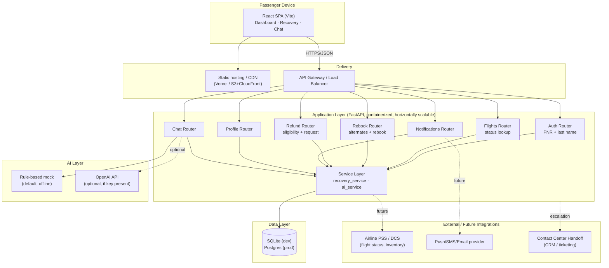

# Architecture

## System Diagram

## Why this shape

**Thin client, fat service layer.** All disruption logic — what counts as a
disruption, how alternates are scored, whether a refund is owed — lives in
`services/recovery_service.py`, not in route handlers or the frontend. That
keeps the rules testable in isolation and reusable: the REST API and the AI
assistant both call the same scoring/eligibility functions, so a passenger
gets the same answer whether they tap a button or ask the chatbot.

**Stateless API, swappable data store.** FastAPI containers hold no session
state (the demo token is just an encoded booking id), so they scale
horizontally behind a load balancer. SQLite is used for local development and
grading convenience; the `DATABASE_URL` env var is the only change needed to
point at Postgres in production.

**AI is pluggable, not load-bearing.** The chat assistant defaults to a
deterministic rule-based responder so the whole demo works with zero external
dependencies and zero latency risk during judging. Setting `OPENAI_API_KEY`
swaps in real completions without any other code change, and the service
fails open back to the mock if the API call errors.

## Production hardening (beyond this MVP)

- **Auth**: replace the demo token with signed JWTs issued after PNR
  verification, short expiry, refresh flow.
- **Real flight data**: `flight-status` and `alternate-flights` would call
  the airline's PSS/DCS (e.g., Amadeus, Sabre) instead of the local DB;
  the service layer's interface wouldn't need to change.
- **Rate limiting & WAF** at the gateway to protect the login endpoint from
  PNR enumeration.
- **Observability**: structured logging + tracing per request, dashboards on
  rebook/refund conversion and AI deflection rate (see Business Understanding
  in the challenge brief — this is the metric the COO actually cares about).
- **Notifications**: wire `Notification` creation to a push/SMS/email
  provider (e.g., SNS, Twilio) instead of only writing a DB row.
- **Database**: Postgres with read replicas for status polling at scale
  during mass-disruption events (the 40%-of-passengers-call scenario is
  exactly when read load spikes hardest).
