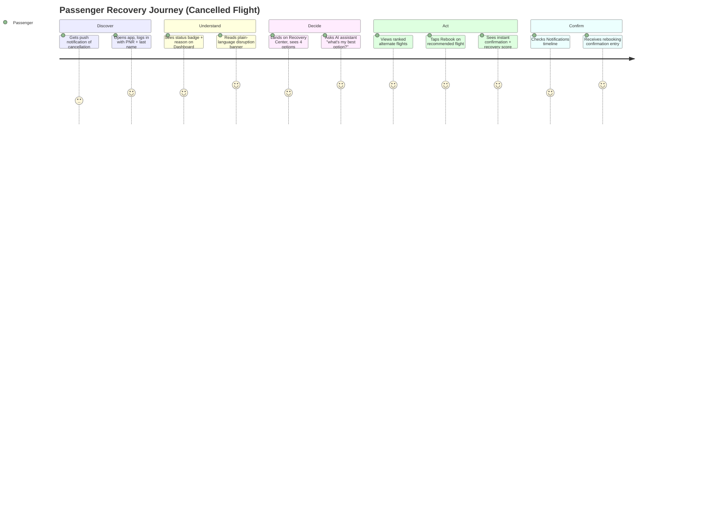

# Customer Journey

## Scope decisions

Disruption scenarios supported in this MVP: **delay** and **cancellation**
(the two that drive ~90%+ of contact-center volume during weather events per
the brief). Diversion is modeled in the data layer for future extension but
not yet surfaced in the UI flows.

Actions automated end-to-end: **status check, rebooking, refund request,
waitlist join, AI Q&A**. Kept agent-assisted: **group/complex itineraries,
disputes over eligibility, anything the assistant can't resolve** — the
"Contact Agent" option is always one tap away and never hidden behind the
self-service flow.

## Journey Map

## Detailed flow (cancelled flight, happy path)

1. **Notification** — passenger is alerted their flight is cancelled (in
   this MVP, surfaced on login/dashboard load; production would push this).
2. **Login** — PNR + last name, no password to remember mid-disruption.
3. **Dashboard** — immediately shows a red disruption banner over the route
   visualization, with a single "View Recovery Options" call to action.
4. **Recovery Center** — four clear paths: Rebook, Refund, Waitlist, Agent.
   No dead ends — every path either completes an action or hands off to a
   human.
5. **Alternate Flights** — ranked by Recovery Score (schedule proximity,
   stops, seat scarcity), with the top pick badged "Best Option" so
   passengers under time pressure don't have to compare manually.
6. **One-tap rebook** — confirmation screen shows the new flight and score;
   booking status updates everywhere else in the app immediately.
7. **AI assistant** — available throughout via floating button; can answer
   "why," recommend the best option, and deep-link straight into the rebook
   or refund flow instead of just describing it.

## Alternate path: refund

Passengers who don't want to travel land on the Refund page instead, see
eligibility and estimated amount computed transparently from policy (not a
black box), choose Full vs. Travel Credit, and submit — with an explicit
note that no real payment is issued in this simulated MVP.

## Escalation path

If self-service can't resolve it (e.g., no alternates left, passenger
prefers a human, or the AI assistant can't help), "Contact Agent" is always
visible — self-service should reduce call volume, not force it to zero.
