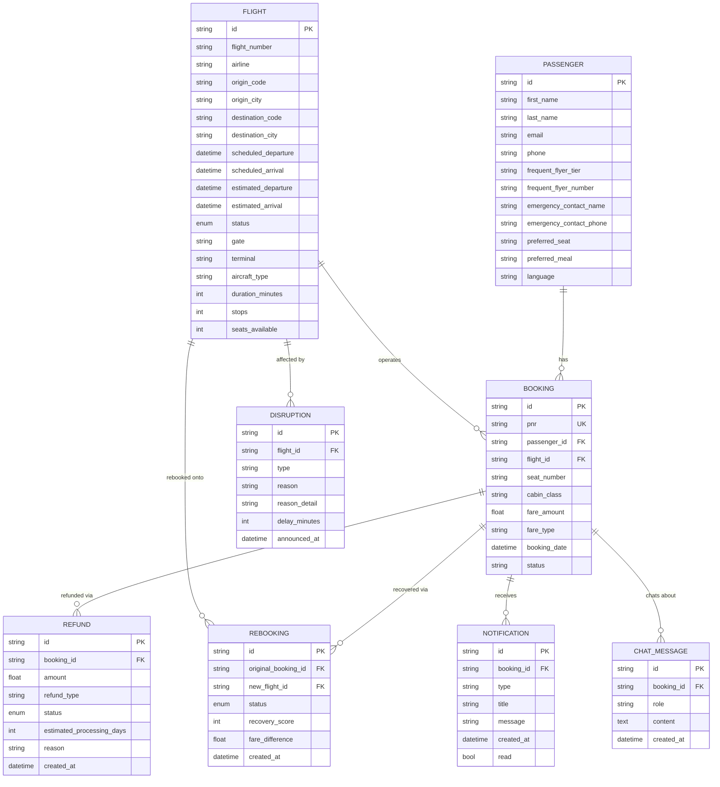

# Database Schema

SQLite for local dev (`skyjet.db`, generated by `services/seed_data.py`);
same models work against Postgres by changing `DATABASE_URL`. Defined in
`backend/models/models.py` with SQLAlchemy.

## Notes

- IDs are prefixed UUIDs (`pax_`, `flt_`, `bkg_`, `dis_`, `rbk_`, `rfd_`,
  `ntf_`, `msg_`) for readability in logs and API responses.
- `Booking.pnr` is unique and is the passenger-facing identifier used at
  login, alongside `Passenger.last_name`.
- `Flight.status` is an enum (`ON_TIME`, `DELAYED`, `CANCELLED`, `DIVERTED`,
  `BOARDING`, `DEPARTED`, `LANDED`) driving both the UI status badge and the
  disruption-detection logic.
- `Rebooking.recovery_score` is computed once at rebook time and stored so
  the confirmation screen and future analytics don't need to recompute it.
- No payment tables exist by design — refunds are simulated per the
  constraint of no payment integration (see `ASSUMPTIONS.md`).
